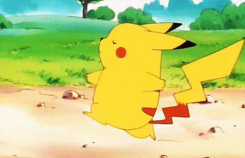

# pikachu-lang
A small toy that provides pikachu language!



# inspired by BrainFuck and [the little book of Rust macros](https://danielkeep.github.io/tlborm/book/index.html)

|  pikachu-lang   |  brainfuck  |   desc   |
|      ----       |    ----     |   ----   |
|pika! pika!      |  >          |    increment the data pointer|
|pika. pika.      |  <          |    decrement the data pointer|
|pika. pika!      |  +          |    increment the byte at pointer|
|pika! pika.      |  -          |    decrement the byte at pointer|
|pikachu!         |  .          |    output the byte at pointer|
|pikachu?         |  ,          |    input of one byte into pointer|
|pika pi?         |  \[          |   Jump forward past the matching \] if the byte at the pointer is zero.|
|pika pi!         |  \]          |    Jump backward to the matching \[ unless the byte at the pointer is zero.|

>below code output:
>>pikachu!

```Rust
    let _ = pikachu!(
        pika! pika! pika. pika! pika. pika! pika. pika! pika. pika! pika. pika! pika. pika!
        pika. pika! pika. pika! pika. pika! pika. pika! pika. pika! pika pi?    pika. pika.
        pika. pika! pika. pika! pika. pika! pika. pika! pika. pika! pika. pika! pika. pika!
        pika. pika! pika. pika! pika. pika! pika! pika! pika! pika. pika pi!    pika. pika.
        pika. pika! pika. pika! pikachu!    pika! pika! pika! pika! pika. pika! pika. pika!
        pika. pika! pika. pika! pika. pika! pika. pika! pika. pika! pika. pika! pika. pika!
        pika. pika! pika pi?    pika. pika. pika. pika! pika. pika! pika. pika! pika. pika!
        pika. pika! pika. pika! pika. pika! pika. pika! pika. pika! pika. pika! pika! pika!
        pika! pika. pika pi!    pika. pika. pika. pika! pika. pika! pika. pika! pika. pika!
        pika. pika! pikachu!    pika! pika! pika! pika! pika. pika! pika. pika! pika. pika!
        pika. pika! pika. pika! pika. pika! pika. pika! pika. pika! pika. pika! pika. pika!
        pika. pika! pika pi?    pika. pika. pika. pika! pika. pika! pika. pika! pika. pika!
        pika. pika! pika. pika! pika. pika! pika. pika! pika. pika! pika. pika! pika! pika!
        pika! pika. pika pi!    pika. pika. pika! pika. pika! pika. pika! pika. pikachu!
        pika! pika! pika! pika! pika. pika! pika. pika! pika. pika! pika. pika! pika. pika!
        pika. pika! pika. pika! pika. pika! pika. pika! pika. pika! pika pi?    pika. pika.
        pika. pika! pika. pika! pika. pika! pika. pika! pika. pika! pika. pika! pika. pika!
        pika. pika! pika. pika! pika. pika! pika! pika! pika! pika. pika pi!    pika. pika.
        pika! pika. pika! pika. pika! pika. pikachu!    pika! pika! pika! pika! pika. pika!
        pika. pika! pika. pika! pika. pika! pika. pika! pika pi?    pika! pika! pika. pika!
        pika pi?    pika. pika. pika. pika! pika. pika! pika! pika! pika! pika. pika pi!
        pika. pika. pika. pika. pika. pika! pika. pika! pika. pika! pika. pika! pika. pika!
        pika. pika! pika! pika! pika! pika. pika! pika. pika! pika. pika pi!    pika. pika.
        pika. pika! pika. pika! pikachu!    pika! pika! pika! pika! pika. pika! pika. pika!
        pika. pika! pika. pika! pika. pika! pika. pika! pika. pika! pika. pika! pika. pika!
        pika. pika! pika. pika! pika pi?    pika. pika. pika. pika! pika. pika! pika. pika!
        pika. pika! pika. pika! pika. pika! pika. pika! pika. pika! pika. pika! pika. pika!
        pika! pika! pika! pika. pika pi!    pika. pika. pika. pika! pika. pika! pikachu!
        pika! pika! pika! pika! pika. pika! pika. pika! pika. pika! pika. pika! pika. pika!
        pika. pika! pika. pika! pika. pika! pika. pika! pika. pika! pika pi?    pika. pika.
        pika. pika! pika. pika! pika. pika! pika. pika! pika. pika! pika. pika! pika. pika!
        pika. pika! pika. pika! pika. pika! pika! pika! pika! pika. pika pi!    pika. pika.
        pika. pika! pika. pika! pika. pika! pika. pika! pika. pika! pikachu!    pika! pika!
        pika! pika! pika. pika! pika. pika! pika. pika! pika. pika! pika. pika! pika. pika!
        pika. pika! pika. pika! pika. pika! pika. pika! pika. pika! pika pi?    pika. pika.
        pika. pika! pika. pika! pika. pika! pika. pika! pika. pika! pika. pika! pika. pika!
        pika. pika! pika. pika! pika. pika! pika! pika! pika! pika. pika pi!    pika. pika.
        pika! pika. pika! pika. pika! pika. pikachu!    pika! pika! pika! pika! pika. pika!
        pika. pika! pika. pika! pika. pika! pika. pika! pika. pika! pika. pika! pika. pika!
        pika. pika! pika. pika! pika pi?    pika. pika. pika. pika! pika. pika! pika. pika!
        pika. pika! pika. pika! pika. pika! pika. pika! pika. pika! pika. pika! pika. pika!
        pika! pika! pika! pika. pika pi!    pika. pika. pika! pika. pika! pika. pika! pika.
        pikachu!    pika! pika! pika! pika! pika. pika! pika. pika! pika. pika! pika. pika!
        pika. pika! pika. pika! pika. pika! pika. pika! pika. pika! pika. pika! pika pi?
        pika. pika. pika. pika! pika. pika! pika. pika! pika. pika! pika. pika! pika. pika!
        pika. pika! pika. pika! pika. pika! pika. pika! pika! pika! pika! pika. pika pi!
        pika. pika. pika! pika. pikachu!    pika! pika! pika! pika! pika. pika! pika. pika!
        pika. pika! pika. pika! pika. pika! pika. pika! pika. pika! pika. pika! pika. pika!
        pika. pika! pika pi?    pika. pika. pika. pika! pika. pika! pika. pika! pika. pika!
        pika. pika! pika. pika! pika. pika! pika. pika! pika. pika! pika. pika! pika! pika!
        pika! pika. pika pi!    pika. pika. pika. pika! pika. pika! pika. pika! pika. pika!
        pikachu!    pika! pika! pika! pika! pika. pika! pika. pika! pika. pika! pika. pika!
        pika. pika! pika. pika! pika. pika! pika. pika! pika. pika! pika. pika! pika pi?
        pika. pika. pika. pika! pika. pika! pika. pika! pika. pika! pika. pika! pika. pika!
        pika. pika! pika. pika! pika. pika! pika. pika! pika. pika! pika. pika! pika! pika!
        pika! pika. pika pi!    pika. pika. pika! pika. pika! pika. pika! pika. pikachu!
        pika! pika! pika! pika! pika. pika! pika. pika! pika. pika! pika. pika! pika. pika!
        pika pi?    pika! pika! pika. pika! pika pi?    pika. pika. pika. pika! pika. pika!
        pika! pika! pika! pika. pika pi!    pika. pika. pika. pika. pika. pika! pika. pika!
        pika. pika! pika. pika! pika. pika! pika. pika! pika! pika! pika! pika. pika! pika.
        pika! pika. pika pi!    pika. pika. pika. pika! pika. pika! pika. pika! pikachu!
    );

```


